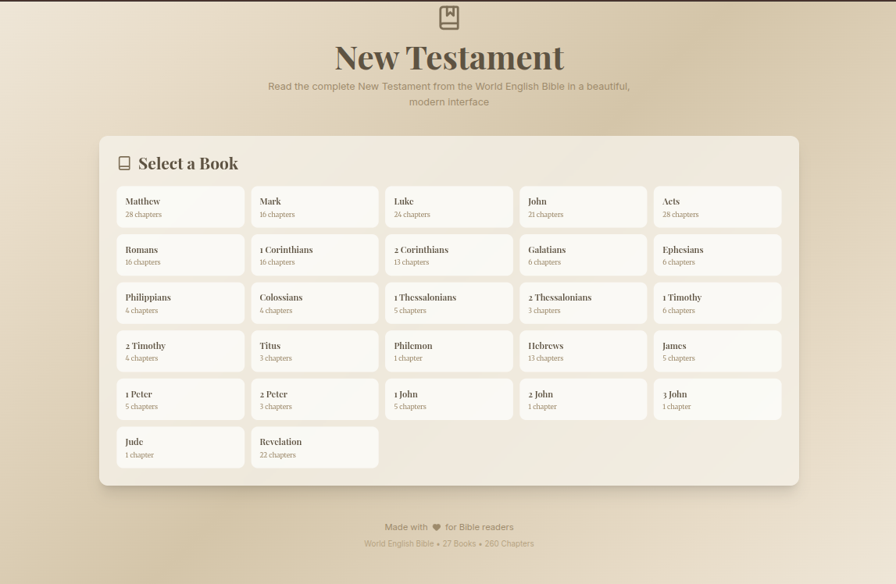

[](https://bible-new-testament.vercel.app/)

# New Testament Reader

A beautiful, modern web application for reading the entire New Testament, built with Next.js, TypeScript, and Tailwind CSS.

🔗 **Live Demo**: [https://bible-new-testament.vercel.app/](https://bible-new-testament.vercel.app/)

## Features

- **Complete New Testament**: All 27 books with 260 chapters from the World English Bible
- **Beautiful Design**: Beige linear gradients with elegant typography
- **Responsive**: Works perfectly on mobile, tablet, and desktop
- **Lucide Icons**: Modern, beautiful icons throughout the interface
- **Custom Fonts**:
  - Playfair Display for headings
  - Merriweather for body text
  - Inter for UI elements
- **Easy Navigation**:
  - Browse all books
  - Select chapters
  - Navigate between chapters with previous/next buttons
- **Smooth Experience**: Fast loading, smooth transitions, and intuitive interface

## Getting Started

### Development Server

```bash
npm run dev
```

Open [http://localhost:3000](http://localhost:3000) in your browser.

### Build for Production

```bash
npm run build
npm start
```

## Project Structure

```
bible-reader/
├── app/
│   ├── api/
│   │   └── bible-data/
│   │       └── route.ts          # API endpoint for Bible data
│   ├── globals.css               # Global styles with beige gradients
│   ├── layout.tsx                # Root layout
│   └── page.tsx                  # Main page with navigation logic
├── components/
│   ├── BookSelector.tsx          # Book selection interface
│   ├── ChapterSelector.tsx       # Chapter selection interface
│   └── BibleReader.tsx           # Reading interface with navigation
├── data/
│   └── new-testament-data.json   # Complete New Testament data
└── public/                       # Static files

## Technology Stack

- **Next.js 16**: React framework with App Router
- **TypeScript**: Type-safe development
- **Tailwind CSS**: Utility-first CSS framework
- **Lucide React**: Beautiful icon library
- **Custom Fonts**: Google Fonts (Playfair Display, Merriweather, Inter)

## Design System

### Colors
- Beige palette from light (#faf8f3) to dark (#3f382d)
- Linear gradients for backgrounds
- Warm, inviting color scheme

### Typography
- **Display**: Playfair Display (headings)
- **Serif**: Merriweather (body text)
- **Sans**: Inter (UI elements)

### Responsive Breakpoints
- Mobile: < 640px
- Tablet: 640px - 1024px
- Desktop: > 1024px

## API Usage

Total API calls used: **288 out of 5000** (5.76%)
- Downloaded 27 books
- Downloaded 260 chapters
- Data stored locally for fast access

## License

This project uses the World English Bible, which is in the public domain.
